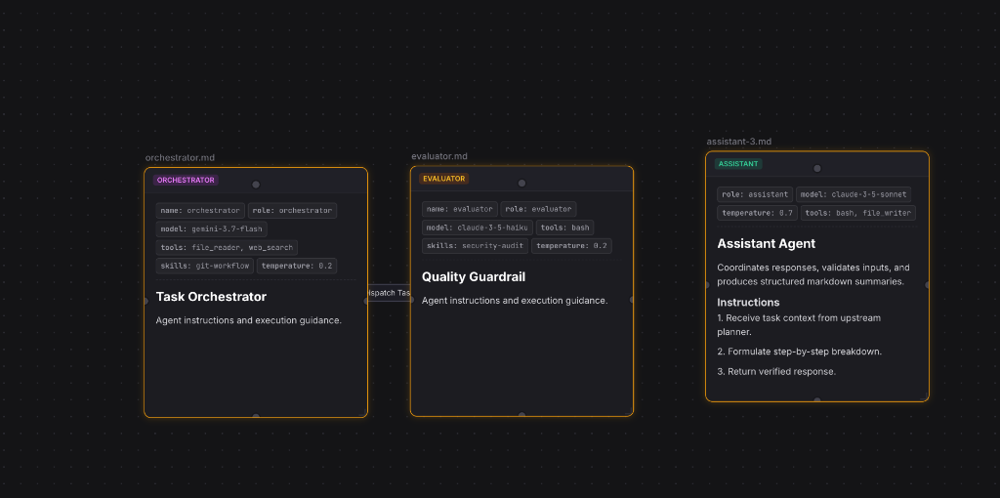
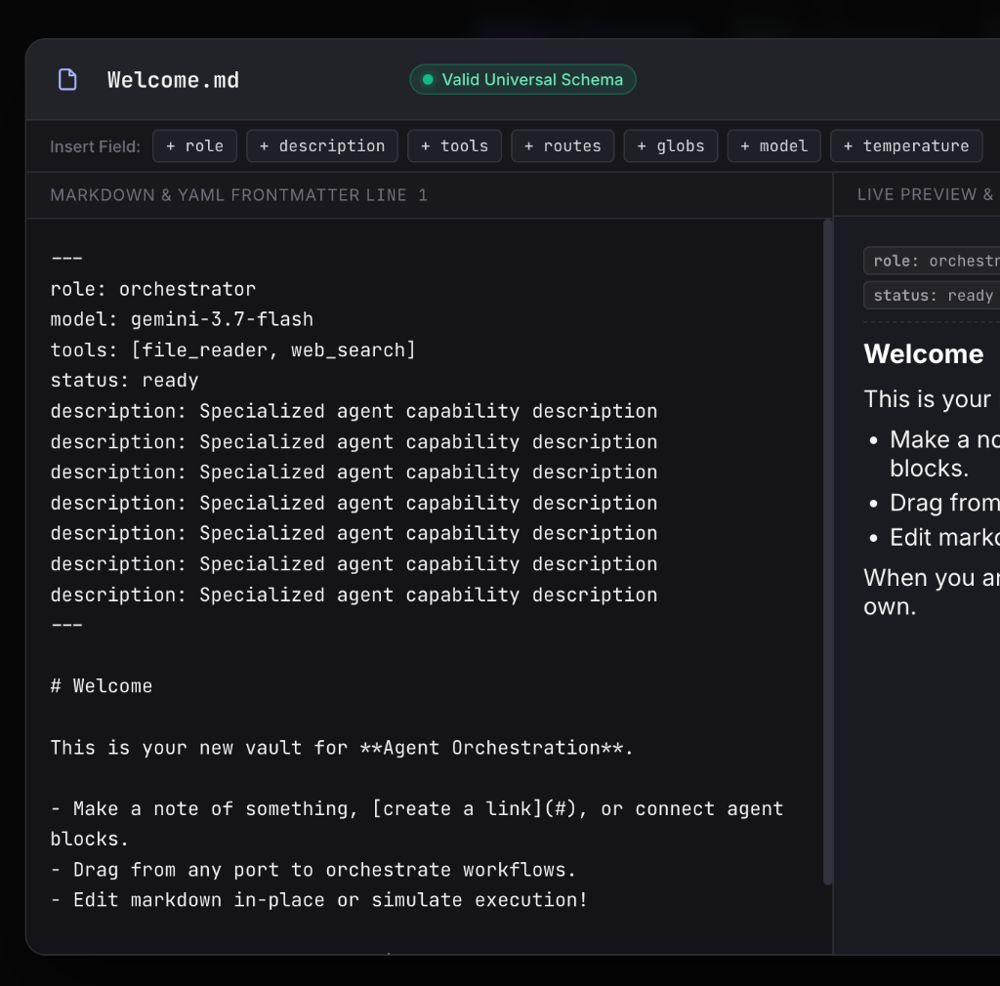
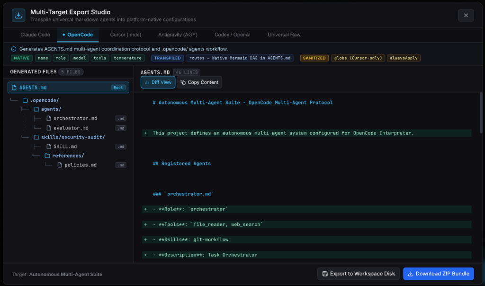
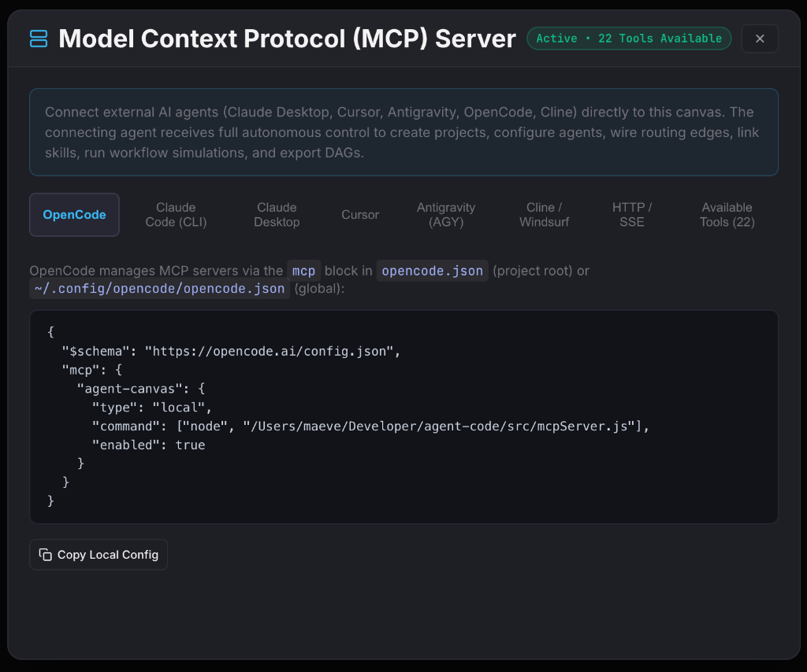

# Agent Canvas

> Visual Multi-Agent Orchestrator & Transpiler for Universal Markdown (`.md`) AI Agents.

[](https://nodejs.org)
[](https://nodejs.org/api/esm.html)
[](https://nodejs.org/api/sqlite.html)
[](LICENSE)

**Agent Canvas** is an open-source visual workflow environment and multi-harness compiler for building, orchestrating, and executing autonomous multi-agent AI systems. Every agent is backed directly by a human-readable Markdown file with YAML frontmatter, synced bidirectionally to local disk with zero vendor lock-in.

---

## Visual Overview

### 1. Interactive Multi-Agent Canvas
Design complex multi-agent workflows with smooth panning, zooming, draggable port terminals, conditional Pass/Fail transition pills, and a real-time radar minimap.



### 2. Deep Markdown & Universal Schema Editor
Live split-pane editor with instant AST frontmatter parsing, duplicate key linter, dynamic presence chips, skill linkers, and an interactive role capability inspector.



### 3. Multi-Target Export Studio
Compile your universal agent graphs into platform-native configurations across major AI coding harnesses with one click or native ZIP bundling.



### 4. Native Model Context Protocol (MCP) Server
Equipped with 22 built-in MCP tool endpoints, allowing external agents (Claude Desktop, Cursor, OpenCode, Antigravity, Cline) to inspect, edit, and orchestrate canvases programmatically.



---

## Key Features

- **Universal Agent Markdown Schema**: Standalone `.md` files with YAML frontmatter defining roles, models, tools, skills, routing edges, globs, and sampling parameters.
- **Multi-Target Transpilation**: Compile once, run anywhere across Claude Code, OpenCode, Cursor, Antigravity, Codex / OpenAI, and standalone Node.js engines.
- **Two-Way Realtime Workspace Sync**: Edit on canvas or modify `.md` files in your IDE—changes reflect bidirectionally with SQLite WAL persistence.
- **Zero-Dependency Architecture**: Built on pure Node.js ES Modules with native `node:sqlite` (`DatabaseSync`) and native `node:zlib` archive bundling.
- **Built-in MCP Server**: Expose full graph manipulation and workflow simulation tools via Standard I/O or SSE.
- **In-DOM Directory Browser**: Export directly to local workspace paths with interactive folder navigation, breadcrumbs, and inline folder creation.

---

## Universal Agent Schema

Each agent block is backed by a standalone Markdown file with a YAML frontmatter specification:

```markdown
---
name: evaluator
role: evaluator
model: claude-3-5-haiku
description: Quality auditor verifying test coverage, lint checks, and policy compliance.
tools: [bash, file_reader]
skills: [security-audit]
routes:
  - on: pass
    target: deployer.md
  - on: fail
    target: coder.md
    max_retries: 3
globs: ["src/**/*.js", "tests/**/*.test.js"]
temperature: 0.2
---

# Quality Guardrail & Evaluator

Verifies factual consistency, policy compliance, and test suite verification before downstream execution.
```

### Accepted Universal Roles

| Role | Classification | Core Capability |
| :--- | :--- | :--- |
| `orchestrator` | Supervisor | Coordinates workflows, schedules tasks, and delegates to subagents. |
| `assistant` | Conversational | Executes interactive queries, plans, and general tasks. |
| `researcher` | Read-only | Gathers codebase context, documentation, and web data. |
| `evaluator` | Guardrail | Audits test coverage, lint rules, and security compliance. |
| `router` | Decision Node | Evaluates conditional expressions and branching routes. |
| `coder` | Engineer | Implements, edits, and refactors source code. |
| `tool` | Utility | Executes deterministic bash scripts and standalone utilities. |
| *(None)* | Unconstrained | General standalone agent without role constraints. |

---

## Multi-Target Transpilation Matrix

| Target Platform | Master Configuration | Agent Files & Paths | Transpilation Behavior |
| :--- | :--- | :--- | :--- |
| **Claude Code** | `CLAUDE.md` | `.claude/commands/<agent>.md` | Transpiles tools into `allowed-tools`; formats routing table for slash command orchestration. |
| **OpenCode** | `AGENTS.md` | `.opencode/agents/<agent>.md` | Transpiles transitions into native Mermaid DAG (`graph TD`); sanitizes frontmatter schema. |
| **Cursor** | `.cursorrules` | `.cursor/rules/<agent>.mdc` | Contextual rule triggers with `globs` matching and `alwaysApply: false`. |
| **Antigravity (AGY)** | `GEMINI.md` | `.gemini/antigravity/skills/<agent>/SKILL.md` | Transpiles routes into `invoke_subagent` delegation directives with retry guardrails. |
| **Codex / OpenAI** | `codex.json` | `instructions/<agent>.md` | Transpiles tools to OpenAI tool call schemas; maps `model` and `temperature` parameters. |
| **Universal Raw** | `workflow.js` | `<agent>.md` | Raw vault preservation with standalone Node.js DAG execution runner. |

---

## Quick Start

### Prerequisites
- Node.js 20+ (Node 22 or Node 26 recommended)
- Modern web browser

### Installation & Launch

```bash
# Clone repository
git clone https://github.com/your-org/agent-code.git
cd agent-code

# Start server
npm start
```

Open your browser at `http://localhost:3000`.

---

## Model Context Protocol (MCP) Setup

To connect external AI agents to your canvas, register the MCP server in your client configuration:

### Claude Desktop (`claude_desktop_config.json`)
```json
{
  "mcpServers": {
    "agent-canvas": {
      "command": "node",
      "args": ["/absolute/path/to/agent-code/src/mcpServer.js"]
    }
  }
}
```

### Cursor (`.cursor/mcp.json`) / OpenCode (`opencode.json`)
```json
{
  "mcp": {
    "agent-canvas": {
      "type": "local",
      "command": ["node", "/absolute/path/to/agent-code/src/mcpServer.js"],
      "enabled": true
    }
  }
}
```

---

## Project Structure

```
.
├── src/
│   ├── server.js              # HTTP server, REST endpoints, and filesystem routing
│   ├── database.js            # Node:sqlite WAL database schema & queries
│   ├── mcpServer.js           # Model Context Protocol (MCP) server with 22 tool actions
│   └── exporters/             # Provider-native transpiler compilers
│       ├── index.js           # Multi-target compiler registry
│       ├── claudeCode.js      # CLAUDE.md & slash command transpiler
│       ├── openCode.js        # AGENTS.md & Mermaid DAG compiler
│       ├── cursor.js          # Cursor .mdc & glob rules transpiler
│       ├── antigravity.js     # Antigravity GEMINI.md & skills compiler
│       ├── codex.js           # OpenAI Assistants v2 schema transpiler
│       ├── raw.js             # Standalone workflow.js runner transpiler
│       └── zipBuilder.js      # Dependency-free node:zlib archive generator
├── public/                    # Frontend client
│   ├── index.html             # Canvas layout, toolbar, and DOM overlays
│   ├── style.css              # Obsidian dark theme design system
│   └── js/                    # Client application modules
│       ├── app.js             # Main controller, project selector, and modals
│       ├── canvas.js          # Infinite canvas engine, bezier routing, minimap
│       ├── validator.js       # AST YAML schema validator and role definitions
│       ├── exportStudio.js    # Transpilation preview & ZIP bundler
│       ├── dialog.js          # In-DOM dialogs & directory browser
│       └── skillsManager.js   # Skills library catalog & linker
├── workspace/                 # On-disk mirrored agent vaults (.md files)
├── docs/                      # Documentation assets & screenshots
└── package.json
```

---

## License

MIT License. Free and open source for developers and autonomous agent builders.
